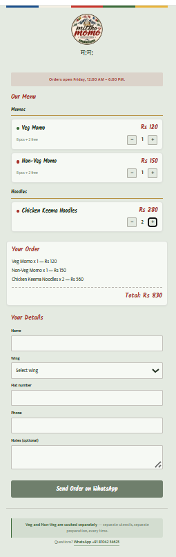

# Mittho MoMo — Online Ordering Page

A zero-cost, zero-backend ordering page for a home kitchen selling fresh Himalayan momos in a Mumbai housing society.

**Live:** https://mittho-momo.pages.dev



---

## The problem

Mittho MoMo is a one-person home kitchen. Orders arrived as free-text WhatsApp messages — "2 veg 1 chicken send by 7" — which meant constant back-and-forth to pin down quantities, flat numbers and totals. With a few dozen orders in a single evening, that overhead becomes the bottleneck, not the cooking.

The kitchen also had no budget for hosting, a payment gateway, or a delivery platform's commission.

## The approach

A static page with no server, no database and no payment integration. Customers build their order in the browser; on submit, the page composes a formatted message and hands it to WhatsApp via a `wa.me` deep link. The cook receives a clean, complete order in the app she already lives in, and confirms directly.

This keeps running costs at zero and adds no new tool for her to check.

```
Customer picks items  →  cart state in browser  →  formatted text
                                                        ↓
                                              wa.me deep link
                                                        ↓
                                              Cook's WhatsApp
```

## Features

- **Data-driven menu** — items live in a single array; prices and products are never hardcoded in markup
- **Live cart** with per-item quantity controls and running total
- **Order window logic** — orders are open every Friday, 12:00 AM–6:00 PM IST, checked against Kolkata time regardless of the visitor's device timezone, with submission disabled outside that window
- **Client-side validation** with inline field highlighting
- **WhatsApp handoff** with correct URL encoding for multi-line messages
- **Veg / non-veg labelling** following Indian food-marking convention, with separate-preparation disclosure surfaced at the point of choice
- **Mobile-first** — the entire audience arrives via a link shared in a WhatsApp group

## Tech

Vanilla HTML, CSS and JavaScript. No framework, no build step, no dependencies.

That was a deliberate constraint rather than a limitation. The site is three files served statically; a framework would have added a build pipeline and hundreds of kilobytes to a page that renders three products.

Hosted on Cloudflare Pages.

## Structure

```
mittho-momo/
├── index.html
├── css/
│   └── styles.css
├── js/
│   ├── menu.js      # menu data + order window config
│   └── app.js       # rendering, cart, validation, message building
└── images/
```

## Configuration

The menu — changed week to week — and the order window hours — changed only if the weekly schedule itself moves — live at the top of `js/menu.js`:

```js
const ORDER_OPEN_HOUR = 0;   // 12:00 AM
const ORDER_CLOSE_HOUR = 18; // 6:00 PM

const menu = [
  { id: 'veg', name: 'Veg Momo', price: 120, type: 'veg', isVeg: true, pieces: 8, freePieces: 2, category: 'momo' },
  // ...
];
```

Editing a price or adding an item requires no HTML changes — the menu renders from this array.

## Notable decisions

**No time-slot selection.** An earlier draft let customers choose a delivery window. Removed after thinking through the kitchen's constraints: a solo cook can't serve fifteen orders that all request 7:00 PM. Batching and messaging directly turned out to be better than a feature that quietly overpromised.

**Order window read from Kolkata time via `Intl.DateTimeFormat`, never the device's local clock.** The site is maintained from Nepal and used in India — 15 minutes apart. Computing the day/hour directly in Asia/Kolkata avoids a class of bug that only appears across borders.

**Cart state as the single source of truth.** Clicks mutate a `cart` object and then trigger a full re-render; nothing reads values back off the DOM. This is the same one-directional pattern React formalises, implemented by hand.

## Running locally

Clone and open `index.html`, or use a local server for live reload:

```bash
git clone https://github.com/Srijannsm/mittho-momo.git
cd mittho-momo
# VS Code: right-click index.html → Open with Live Server
```

No install step.

## Possible next steps

- Installable as a PWA for repeat customers
- Remember name and flat number between visits via `localStorage`
- Open Graph tags so the link preview looks right when shared in group chats

---

Built for a family venture. If it's useful to another home kitchen, take it.
